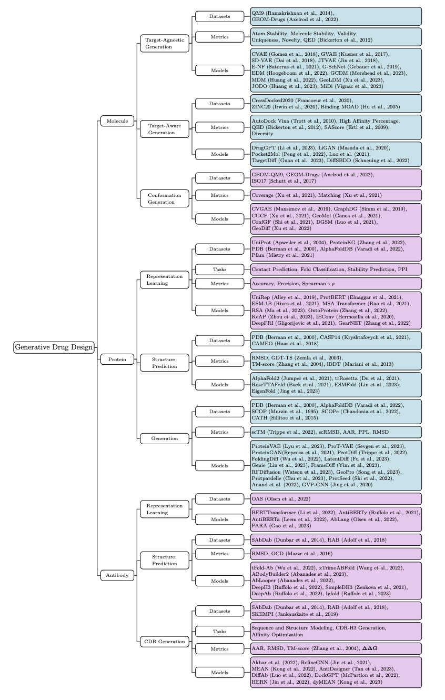

# GenAI4Drug

Repository for the survey paper "A Survey of Generative AI for *de novo* Drug Discovery: New Frontiers in Molecule and Protein Design".

<p align="center">
Xiangru Tang<sup>1</sup>*, Howard Dai<sup>1</sup>*, Elizabeth Knight<sup>1</sup>*, Yunyang Li<sup>1</sup>, Fang Wu<sup>2</sup>, Tianxiao Li<sup>1</sup>, Mark Gerstein<sup>1</sup>
</p> 

<p align="center">
1. Yale University, New Haven; 2. Tsinghua University, China<br>
 (*: Equal Contribution)
</p> 

## Table of Contents
[**] denotes appendix sections.

Section | Subsection | Datasets | Metrics | Models 
---------|---------- | ------------- |---- | --- 
[Molecule](#molecule-design) | [Target-Agnostic Generation](#target-agnostic-generation) | [Datasets](#datasets) | [Metrics](#metrics) | [Models](#models)
[Molecule](#molecule-design) | [Target-Aware Generation](#target-aware-generation) | [Datasets](#datasets-1) | [Metrics](#metrics-1) | [Models](#models-1)
[Molecule](#molecule-design) | [Conformation Generation**](#conformation-generation-appendix) | [Datasets](#datasets-2) | [Metrics](#metrics-2) | [Models](#models-2)
[Protein](#protein-design) | [Representation Learning**](#representation-learning-appendix) | [Datasets](#datasets-3) |     | [Models](#models-3)
[Protein](#protein-design) | [Structure Prediction](#structure-prediction) | [Datasets](#datasets-4) | [Metrics](#metrics-3) | [Models](#models-4)
[Protein](#protein-design) | [Generation](#generation) | [Datasets](#datasets-5) | [Metrics](#metrics-4) | [Models](#models-5)
[Antibody](#antibody-design) | [Representation Learning**](#representation-learning-appendix-1) | [Datasets](#datasets-6) |   | [Models](#models-6)
[Antibody](#antibody-design) | [Structure Prediction**](#structure-prediction-appendix) | [Datasets](#datasets-7) | [Metrics](#metrics-5) | [Models](#models-7)
[Antibody](#antibody-design) | [CDR Generation**](#cdr-generation-appendix) | [Datasets](#datasets-8) | [Metrics](#metrics-6) | [Models](#models-8)
  


## Cite us
```
@article{tang2024gaisurvey,
  title={A Survey of Generative AI for De Novo Drug Design: New Frontiers in Molecule and Protein Generation},
  author={Tang, Xiangru and Dai, Howard and Knight, Elizabeth and Wu, Fang and Li, Yunyang and Li, Tianxiao and Gerstein, Mark},
  journal={arXiv preprint arXiv:2402.08703},
  year={2023}
}
```


## Overview of Topics

An overview of topics covered in our paper. Sections highlighted in blue can be found in the main text, while purple sections are extended sections found in the appendix. 

<p align="center">
  <br>
  <!--   -->
  
</p>


<!---   
# Technical Background 
TODO: update the photo with a new screenshot (changed RFDiffusion citation)

INSERT TABLE W/ TECH PAPERS
            
* **Paper Title** (Model name)   
 Author1, Author2, ...   
Conference (Year)  -->

# Molecule Design 

## Target-Agnostic Generation


### Datasets
* **Quantum chemistry structures and properties of 134 kilo molecules** (QM9)   
 Raghunathan Ramakrishnan, Pavlo O. Dral, Matthias Rupp, O. Anatole von Lilienfeld     
 [Scientific Data (2014)](https://www.nature.com/articles/sdata201422)

* **GEOM, energy-annotated molecular conformations for property prediction and molecular generation** (GEOM)   
Simon Axelrod, Rafael Gómez-Bombarelli   
 [Scientific Data (2022)](https://www.nature.com/articles/s41597-022-01288-4)  


### Metrics

* **Quantifying the chemical beauty of drugs** (QED)    
  G Richard Bickerton, Gaia V Paolini, Jérémy Besnard, Sorel Muresan, Andrew L Hopkins    
  [Nature Chemistry (2012)](https://pubmed.ncbi.nlm.nih.gov/22270643/)


### Models

* **Automatic Chemical Design Using a Data-Driven Continuous Representation of Molecules** (CVAE)   
 Rafael Gómez-Bombarelli, Jennifer N. Wei, David Duvenaud, JoséMiguel Hernández-Lobato, BenjamínSánchez-Lengeling, Dennis Sheberla, Jorge Aguilera-Iparraguirre, Timothy D. Hirzel, Ryan P. Adams, and Alán Aspuru-Guzik    
[ACS Central Science (2018)](https://pubs.acs.org/doi/full/10.1021/acscentsci.7b00572)

* **Grammar Variational Autoencoder** (GVAE)   
 Matt J. Kusner, Brooks Paige, José Miguel Hernández-Lobato    
[ICML 2017](https://proceedings.mlr.press/v70/kusner17a.html?ref=https://githubhelp.com)

* **Syntax-Directed Variational Autoencoder for Structured Data** (SD-VAE)   
 Hanjun Dai, Yingtao Tian, Bo Dai, Steven Skiena, Le Song    
[ICLR 2018](https://arxiv.org/abs/1802.08786)

* **Junction Tree Variational Autoencoder for Molecular Graph Generation** (JT-VAE)   
 Wengong Jin, Regina Barzilay, Tommi Jaakkola    
[ICML 2018](https://proceedings.mlr.press/v80/jin18a.html)

* **E(n) Equivariant Normalizing Flows** (E-NF)   
 Victor Garcia Satorras, Emiel Hoogeboom, Fabian Fuchs, Ingmar Posner, Max Welling    
[NeurIPS 2021](https://proceedings.neurips.cc/paper_files/paper/2021/hash/21b5680d80f75a616096f2e791affac6-Abstract.html)

* **Symmetry-adapted generation of 3d point sets for the targeted discovery of molecules** (G-SchNet)   
 Niklas Gebauer, Michael Gastegger, Kristof Schütt    
[NeurIPS 2019](https://proceedings.neurips.cc/paper/2019/hash/a4d8e2a7e0d0c102339f97716d2fdfb6-Abstract.html)

* **Equivariant Diffusion for Molecule Generation in 3D** (EDM)   
 Emiel Hoogeboom, Vı́ctor Garcia Satorras, Clément Vignac, Max Welling     
[ICML 2022](https://proceedings.mlr.press/v162/hoogeboom22a.html)

* **Geometry-Complete Diffusion for 3D Molecule Generation and Optimization** (GCDM)   
 Alex Morehead, Jianlin Cheng     
[arXiv:2302.04313 (2023)](https://arxiv.org/abs/2302.04313)

* **MDM: Molecular Diffusion Model for 3D Molecule Generation** (MDM)   
 Lei Huang, Hengtong Zhang, Tingyang Xu, Ka-Chun Wong     
[AAAI 2023](https://ojs.aaai.org/index.php/AAAI/article/view/25639)

* **Geometric Latent Diffusion Models for 3D Molecule Generation** (GeoLDM)   
 Minkai Xu, Alexander S Powers, Ron O. Dror, Stefano Ermon, Jure Leskovec    
[ICML 2023](https://proceedings.mlr.press/v202/xu23n.html)

* **Learning Joint 2D & 3D Diffusion Models for Complete Molecule Generation** (JODO)   
 Han Huang, Leilei Sun, Bowen Du, Weifeng Lv       
[arXiv:2305.12347 (2023)](https://arxiv.org/abs/2305.12347)

* **MiDi: Mixed Graph and 3D Denoising Diffusion for Molecule Generation** (MiDi)   
 Clement Vignac, Nagham Osman, Laura Toni, Pascal Frossard           
 [arXiv:2302.09048 (2023)](https://arxiv.org/abs/2302.09048)


## Target-Aware Generation


### Datasets

* **Three-Dimensional Convolutional Neural Networks and a Cross-Docked Data Set for Structure-Based Drug Design** (CrossDocked2020)   
 Paul G. Francoeur, Tomohide Masuda, Jocelyn Sunseri, Andrew Jia, Richard B. Iovanisci, Ian Snyder, David R. Koes    
[ACS JCIM 2020](https://pubs.acs.org/doi/full/10.1021/acs.jcim.0c00411)

* **ZINC20—A Free Ultralarge-Scale Chemical Database for Ligand Discovery** (ZINC20)   
 John J. Irwin, Khanh G. Tang, Jennifer Young, Chinzorig Dandarchuluun, Benjamin R. Wong, Munkhzul Khurelbaatar, Yurii S. Moroz, John Mayfield, Roger A. Sayle     
[ACS JCIM 2020](https://pubs.acs.org/doi/full/10.1021/acs.jcim.0c00675)

* **Binding MOAD (Mother Of All Databases)** (Binding MOAD)   
 Liegi Hu, Mark L. Benson, Richard D. Smith, Michael G. Lerner, Heather A. Carlson      
[Proteins 2005](https://onlinelibrary.wiley.com/doi/full/10.1002/prot.20512)


### Metrics

* **AutoDock Vina: Improving the speed and accuracy of docking with a new scoring function, efficient optimization, and multithreading** (Vina AutoDock)   
 Oleg Trott, Arthur J. Olson     
[JCC 2010](https://onlinelibrary.wiley.com/doi/full/10.1002/jcc.21334)

* **Quantifying the chemical beauty of drugs** (QED)
  G Richard Bickerton, Gaia V Paolini, Jérémy Besnard, Sorel Muresan, Andrew L Hopkins    
  [Nature Chemistry (2012)](https://pubmed.ncbi.nlm.nih.gov/22270643/)

* **Estimation of synthetic accessibility score of drug-like molecules based on molecular complexity and fragment contributions** (SAScore)   
 Peter Ertl, Ansgar Schuffenhauer 
[Journal of Cheminformatics 2009](https://link.springer.com/article/10.1186/1758-2946-1-8)


### Models

* **DrugGPT: A GPT-based Strategy for Designing Potential Ligands Targeting Specific Proteins** (DrugGPT)   
Yuesen Li, Chengyi Gao, Xin Song, Xiangyu Wang, Yungang Xu, Suxia Han     
[bioRxiv (2023)](https://www.biorxiv.org/content/10.1101/2023.06.29.543848v1.abstract)

* **Generating 3D Molecular Structures Conditional on a Receptor Binding Site with Deep Generative Models** (LiGAN)   
 Tomohide Masuda, Matthew Ragoza, David Ryan Koes       
 [arXiv:2010.14442 (2020)](https://arxiv.org/abs/2010.14442)

* **Pocket2Mol: Efficient Molecular Sampling Based on 3D Protein Pockets** (Pocket2Mol)     
 Xingang Peng, Shitong Luo, Jiaqi Guan, Qi Xie, Jian Peng, Jianzhu Ma      
[ICML 2022](https://proceedings.mlr.press/v162/peng22b.html)

* **A 3D Generative Model for Structure-Based Drug Design**        
  Shitong Luo, Jiaqi Guan, Jianzhu Ma, Jian Peng         
[NeurIPS 2021](https://proceedings.neurips.cc/paper_files/paper/2021/hash/314450613369e0ee72d0da7f6fee773c-Abstract.html)

* **3D Equivariant Diffusion for Target-Aware Molecule Generation and Affinity Prediction** (TargetDiff)
  Jiaqi Guan, Wesley Wei Qian, Xingang Peng, Yufeng Su, Jian Peng, Jianzhu Ma     
  [ICLR 2023](https://arxiv.org/abs/2303.03543)

* **Structure-based Drug Design with Equivariant Diffusion Models** (DiffSBDD)   
 Arne Schneuing, Yuanqi Du, Charles Harris, Arian Jamasb, Ilia Igashov, Weitao Du, Tom Blundell, Pietro Lió, Carla Gomes, Max Welling, Michael Bronstein, Bruno Correia      
  [arXiv:2210.13695 (2022)](https://arxiv.org/abs/2210.13695)  


## Conformation Generation (appendix)


### Datasets

* **GEOM, energy-annotated molecular conformations for property prediction and molecular generation** (GEOM)   
 Simon Axelrod, Rafael Gómez-Bombarelli    
[Scientific Data 2022](https://www.nature.com/articles/s41597-022-01288-4)

* **SchNet: A continuous-filter convolutional neural network for modeling quantum interactions** (ISO17)    
 Kristof Schütt, Pieter-Jan Kindermans, Huziel Enoc Sauceda Felix, Stefan Chmiela, Alexandre Tkatchenko, Klaus-Robert Müller      
[NeurIPS 2017](https://proceedings.neurips.cc/paper/2017/hash/303ed4c69846ab36c2904d3ba8573050-Abstract.html)


### Metrics

* **Learning Neural Generative Dynamics for Molecular Conformation Generation** (Coverage, Matching)   
 Minkai Xu, Shitong Luo, Yoshua Bengio, Jian Peng, Jian Tang           
[ICLR 2021](https://arxiv.org/abs/2102.10240) 


### Models

* **Molecular Geometry Prediction using a Deep Generative Graph Neural Network** (CVGAE)   
 Elman Mansimov, Omar Mahmood, Seokho Kang, Kyunghyun Cho       
[Scientific Reports 2019](https://www.nature.com/articles/s41598-019-56773-5)

* **A Generative Model for Molecular Distance Geometry** (GraphDG)   
 Gregor N. C. Simm, Jose Miguel Hernandez-Lobato      
[ICML 2020](https://proceedings.mlr.press/v119/simm20a.html)

* **Learning Neural Generative Dynamics for Molecular Conformation Generation** (CGCF)   
 Minkai Xu, Shitong Luo, Yoshua Bengio, Jian Peng, Jian Tang            
[ICLR 2021](https://arxiv.org/abs/2102.10240) 

* **GeoMol: Torsional Geometric Generation of Molecular 3D Conformer Ensembles** (GeoMol)   
 Octavian Ganea, Lagnajit Pattanaik, Connor Coley, Regina Barzilay, Klavs Jensen, William Green, Tommi Jaakkola        
[NeurIPS 2021](https://proceedings.neurips.cc/paper/2021/hash/725215ed82ab6306919b485b81ff9615-Abstract.html)

* **Learning Gradient Fields for Molecular Conformation Generation** (ConfGF)   
 Chence Shi, Shitong Luo, Minkai Xu, Jian Tang       
[ICML 2021](https://proceedings.mlr.press/v139/shi21b.html)

* **Predicting Molecular Conformation via Dynamic Graph Score Matching** (DGSM)   
 Shitong Luo, Chence Shi, Minkai Xu, Jian Tang   
[NeurIPS 2021](https://proceedings.neurips.cc/paper/2021/hash/a45a1d12ee0fb7f1f872ab91da18f899-Abstract.html)

* **GeoDiff: A Geometric Diffusion Model for Molecular Conformation Generation** (GeoDiff)   
 Minkai Xu, Lantao Yu, Yang Song, Chence Shi, Stefano Ermon, Jian Tang  
[ICLR 2022](https://openreview.net/forum?id=PzcvxEMzvQC)


# Protein Design


## Representation Learning (appendix)


### Datasets

* **UniProt: the Universal Protein knowledgebase** (UniProt)   
 Rolf Apweiler, Amos Bairoch, Cathy H. Wu, Winona C. Barker, Brigitte Boeckmann, Serenella Ferro, Elisabeth Gasteiger, Hongzhan Huang, Rodrigo Lopez, Michele Magrane, Maria J. Martin, Darren A. Natale, Claire O'Donovan, Nicole Redaschi, Lai-Su L. Yeh             
[Nucleic Acids Research 2004](https://academic.oup.com/nar/article/32/suppl_1/D115/2505378)

* **OntoProtein: Protein Pretraining With Gene Ontology Embedding** (ProteinKG)   
 Ningyu Zhang, Zhen Bi, Xiaozhuan Liang, Siyuan Cheng, Haosen Hong, Shumin Deng, Jiazhang Lian, Qiang Zhang, Huajun Chen      
[ICLR 2022](https://arxiv.org/abs/2201.11147)

* **The Protein Data Bank** (PDB)   
 Helen M. Berman, John Westbrook, Zukang Feng, Gary Gilliland, T. N. Bhat, Helge Weissig, Ilya N. Shindyalov, Philip E. Bourne       
[Nucleic Acids Research 2000](https://academic.oup.com/nar/article/28/1/235/2384399)

* **AlphaFold Protein Structure Database: massively expanding the structural coverage of protein-sequence space with high-accuracy models** (AlphaFoldDB)   
 Mihaly Varadi, Stephen Anyango, Mandar Deshpande, Sreenath Nair, Cindy Natassia, Galabina Yordanova, David Yuan, Oana Stroe, Gemma Wood, Agata Laydon, Augustin Žídek, Tim Green, Kathryn Tunyasuvunakool, Stig Petersen, John Jumper, Ellen Clancy, Richard Green, Ankur Vora, Mira Lutfi, Michael Figurnov, Andrew Cowie, Nicole Hobbs, Pushmeet Kohli, Gerard Kleywegt, Ewan Birney, Demis Hassabis, Sameer Velankar       
[Nucleic Acids Research 2022](https://academic.oup.com/nar/article/50/D1/D439/6430488)

* **Pfam: The protein families database in 2021** (Pfam)   
 Jaina Mistry, Sara Chuguransky, Lowri Williams, Matloob Qureshi, Gustavo A Salazar, Erik L L Sonnhammer, Silvio C E Tosatto, Lisanna Paladin, Shriya Raj, Lorna J Richardson, Robert D Finn, Alex Bateman      
[Nucleic Acids Research 2021](https://academic.oup.com/nar/article/49/D1/D412/5943818)


### Models

* **Unified rational protein engineering with sequence-based deep representation learning** (UniRep)   
 Ethan C. Alley, Grigory Khimulya, Surojit Biswas, Mohammed AlQuraishi, George M. Church       
[Nature Methods 2019](https://www.nature.com/articles/s41592-019-0598-1)

* **Prottrans: Toward understanding the language of life through self-supervised learning** (ProtBERT)   
 Ahmed Elnaggar, Michael Heinzinger, Christian Dallago, Ghalia Rehawi, Yu Wang, Llion Jones, Tom Gibbs, Tamas Feher, Christoph Angerer, Martin Steinegger, Debsindhu Bhowmik, and Burkhard Rost       
[IEEE PAMI 2021](https://ieeexplore.ieee.org/abstract/document/9477085)

* **Biological structure and function emerge from scaling unsupervised learning to 250 million protein sequences** (ESM-1b)   
 Alexander Rives, Joshua Meier, Tom Sercu, Siddharth Goyal, Zeming Lin, Jason Liu, Demi Guo, Myle Ott, C. Lawrence Zitnick, Jerry Ma, Rob Fergus          
[PNAS 2021](https://www.pnas.org/doi/full/10.1073/pnas.2016239118)

* **MSA Transformer** (MSA Transformer)   
 Roshan M Rao, Jason Liu, Robert Verkuil, Joshua Meier, John Canny, Pieter Abbeel, Tom Sercu, Alexander Rives      
[ICML 2021](https://proceedings.mlr.press/v139/rao21a.html)

* **Retrieved Sequence Augmentation for Protein Representation Learning** (RSA)   
 Chang Ma, Haiteng Zhao, Lin Zheng, Jiayi Xin, Qintong Li, Lijun Wu, Zhihong Deng, Yang Lu, Qi Liu, Lingpeng Kong      
[bioRxiv (2023)](https://www.biorxiv.org/content/10.1101/2023.02.22.529597v3.abstract)

* **OntoProtein: Protein Pretraining With Gene Ontology Embedding** (OntoProtein)   
 Ningyu Zhang, Zhen Bi, Xiaozhuan Liang, Siyuan Cheng, Haosen Hong, Shumin Deng, Jiazhang Lian, Qiang Zhang, Huajun Chen       
[ICLR 2022](https://arxiv.org/abs/2201.11147)

* **Protein Representation Learning via Knowledge Enhanced Primary Structure Modeling** (KeAP)   
 Hong-Yu Zhou, Yunxiang Fu, Zhicheng Zhang, Cheng Bian, Yizhou Yu        
[bioRxiv (2023)](https://www.biorxiv.org/content/10.1101/2023.01.26.525795v1.abstract)

* **Intrinsic-Extrinsic Convolution and Pooling for Learning on 3D Protein Structures** (IEConv)   
 Pedro Hermosilla, Marco Schäfer, Matěj Lang, Gloria Fackelmann, Pere Pau Vázquez, Barbora Kozlíková, Michael Krone, Tobias Ritschel, Timo Ropinski       
[ICLR 2021](https://arxiv.org/abs/2007.06252)

* **Structure-based protein function prediction using graph convolutional networks** (DeepFRI)   
 Vladimir Gligorijević, P. Douglas Renfrew, Tomasz Kosciolek, Julia Koehler Leman, Daniel Berenberg, Tommi Vatanen, Chris Chandler, Bryn C. Taylor, Ian M. Fisk, Hera Vlamakis, Ramnik J. Xavier, Rob Knight, Kyunghyun Cho, Richard Bonneau        
[Nature Communications 2021](https://www.nature.com/articles/s41467-021-23303-9)

* **Protein Representation Learning by Geometric Structure Pretraining** (GearNET)   
 Zuobai Zhang, Minghao Xu, Arian Jamasb, Vijil Chenthamarakshan, Aurelie Lozano, Payel Das, Jian Tang       
 [arXiv:2203.06125 (2022)](https://arxiv.org/abs/2203.06125)


## Structure Prediction


### Datasets

* **The Protein Data Bank** (PDB)   
 Helen M. Berman, John Westbrook, Zukang Feng, Gary Gilliland, T. N. Bhat, Helge Weissig, Ilya N. Shindyalov, Philip E. Bourne       
[Nucleic Acids Research 2000](https://academic.oup.com/nar/article/28/1/235/2384399)

* **Critical assessment of methods of protein structure prediction (CASP)—Round XIV** (CASP14)   
 Andriy Kryshtafovych, Torsten Schwede, Maya Topf, Krzysztof Fidelis, John Moult           
 [Proteins 2021](https://onlinelibrary.wiley.com/doi/full/10.1002/prot.26237)

* **Continuous Automated Model EvaluatiOn (CAMEO) complementing the critical assessment of structure prediction in CASP12** (CAMEO)   
 Jürgen Haas, Alessandro Barbato, Dario Behringer, Gabriel Studer, Steven Roth, Martino Bertoni, Khaled Mostaguir, Rafal Gumienny, Torsten Schwede           
[Proteins 2017](https://onlinelibrary.wiley.com/doi/full/10.1002/prot.25431)


### Metrics

* **LGA: a method for finding 3D similarities in protein structures** (GDT-TS)     
 Adam Zemla           
[Nucleic Acids 2003](https://academic.oup.com/nar/article/31/13/3370/2904193)  

* **Scoring function for automated assessment of protein structure template quality** (TM-score)   
 Yang Zhang, Jeffrey Skolnick        
[Proteins 2004](https://onlinelibrary.wiley.com/doi/full/10.1002/prot.20264)

* **lDDT: a local superposition-free score for comparing protein structures and models using distance difference tests** (lDDT)     
 Valerio Mariani, Marco Biasini, Alessandro Barbato, Torsten Schwede          
[Bioinformatics 2013](https://academic.oup.com/bioinformatics/article/29/21/2722/195896)


### Models

* **Highly accurate protein structure prediction with AlphaFold** (AlphaFold)   
 John Jumper, Richard Evans, Alexander Pritzel, Tim Green, Michael Figurnov, Olaf Ronneberger, Kathryn Tunyasuvunakool, Russ Bates, Augustin Žídek, Anna Potapenko, Alex Bridgland, Clemens Meyer, Simon A. A. Kohl, Andrew J. Ballard, Andrew Cowie, Bernardino Romera-Paredes, Stanislav Nikolov, Rishub Jain, Jonas Adler, Trevor Back, Stig Petersen, David Reiman, Ellen Clancy, Michal Zielinski, Martin Steinegger, Michalina Pacholska, Tamas Berghammer, Sebastian Bodenstein, David Silver, Oriol Vinyals, Andrew W. Senior, Koray Kavukcuoglu, Pushmeet Kohli, Demis Hassabis         
[Nature 2021](https://www.nature.com/articles/s41586-021-03819-2))

* **The trRosetta server for fast and accurate protein structure prediction** (trRosetta)   
 Zongyang Du, Hong Su, Wenkai Wang, Lisha Ye, Hong Wei, Zhenling Peng, Ivan Anishchenko, David Baker, Jianyi Yang
[Nature Protocols 2021](https://www.nature.com/articles/s41596-021-00628-9)

* **Accurate prediction of protein structures and interactions using a three-track neural network** (RoseTTAFold)   
 Minkyung Baek, Frank DiMaio, Ivan Anishchenko, Justas Dauparas, Sergey Ovchinnikov, Gyu Rie Lee, Jue Wang, Qian Cong, Lisa N. Kinch, R. Dustin Schaeffer, Claudia Millán, Hahnbeom Park, Carson Adams, Caleb R. Glassman, Andy DeGiovanni, Jose H. Pereira, Andria V. Rodrigues, Alberdina A. van Dijk, Ana C. Ebrecht, Diederik J. Opperman, Theo Sagmeister, Christoph Buhlheller, Tea Pavkov-Keller, Manoj K. Rathinaswamy, Udit Dalwadi, Calvin K. Yip, John E. Burke, K. Christopher Garcia, Nick V. Grishin, Paul D. Adams, Randy J. Read, David Baker       
[Science 2021](https://www.science.org/doi/10.1126/science.abj8754)

* **Evolutionary-scale prediction of atomic-level protein structure with a language model** (ESMFold)   
 Zeming Lin, Halil Akin, Roshan Rao, Brian Hie, Zhongkai Zhu, Wenting Lu, Nikita Smetanin, Robert Verkuil, Ori Kabeli, Yaniv Shmueli, Allan dos Santos Costa, Maryam Fazel-Zarandi, Tom Sercu, Salvatore Candido, Alexander Rives       
[Science 2023](https://www.science.org/doi/full/10.1126/science.ade2574)

* **EigenFold: Generative Protein Structure Prediction with Diffusion Models** (EigenFold)   
 Bowen Jing, Ezra Erives, Peter Pao-Huang, Gabriele Corso, Bonnie Berger, Tommi Jaakkola      
[arXiv:2304.02198 (2023)](https://arxiv.org/abs/2304.02198)


## Generation 


### Datasets

* **The Protein Data Bank** (PDB)   
 Helen M. Berman, John Westbrook, Zukang Feng, Gary Gilliland, T. N. Bhat, Helge Weissig, Ilya N. Shindyalov, Philip E. Bourne       
[Nucleic Acids Research 2000](https://academic.oup.com/nar/article/28/1/235/2384399)

* **AlphaFold Protein Structure Database: massively expanding the structural coverage of protein-sequence space with high-accuracy models** (AlphaFoldDB)   
 Mihaly Varadi, Stephen Anyango, Mandar Deshpande, Sreenath Nair, Cindy Natassia, Galabina Yordanova, David Yuan, Oana Stroe, Gemma Wood, Agata Laydon, Augustin Žídek, Tim Green, Kathryn Tunyasuvunakool, Stig Petersen, John Jumper, Ellen Clancy, Richard Green, Ankur Vora, Mira Lutfi, Michael Figurnov, Andrew Cowie, Nicole Hobbs, Pushmeet Kohli, Gerard Kleywegt, Ewan Birney, Demis Hassabis, Sameer Velankar       
[Nucleic Acids Research 2022](https://academic.oup.com/nar/article/50/D1/D439/6430488)

* **SCOP: A structural classification of proteins database for the investigation of sequences and structures** (SCOP)   
 Alexey G. Murzin, Steven E. Brenner, Tim Hubbard, Cyrus Chothia
[JMB 1995](https://www.sciencedirect.com/science/article/pii/S0022283605801342)

* **SCOPe: improvements to the structural classification of proteins – extended database to facilitate variant interpretation and machine learning** (SCOPe)   
 John-Marc Chandonia, Lindsey Guan, Shiangyi Lin, Changhua Yu, Naomi K Fox, Steven E Brenner
[Nucleic Acids Research 2022](https://academic.oup.com/nar/article/50/D1/D553/6447236)

* **CATH: comprehensive structural and functional annotations for genome sequences** (CATH)   
 Ian Sillitoe, Tony E. Lewis, Alison Cuff, Sayoni Das, Paul Ashford, Natalie L. Dawson, Nicholas Furnham, Roman A. Laskowski, David Lee, Jonathan G. Lees, Sonja Lehtinen, Romain A. Studer, Janet Thornton, Christine A. Orengo        
[Nucleic Acids Research 2015](https://academic.oup.com/nar/article/43/D1/D376/2439515)


### Metrics

* **Diffusion probabilistic modeling of protein backbones in 3D for the motif-scaffolding problem** (scTM)   
 Brian L. Trippe, Jason Yim, Doug Tischer, David Baker, Tamara Broderick, Regina Barzilay, Tommi Jaakkola      
[ICLR 2023](https://arxiv.org/abs/2206.04119)


### Models

* **ProteinVAE: Variational AutoEncoder for Translational Protein Design** (ProteinVAE)   
 Suyue Lyu, Shahin Sowlati-Hashjin, Michael Garton
[bioRxiv (2023)](https://www.biorxiv.org/content/10.1101/2023.03.04.531110v1.abstract)

* **ProT-VAE: Protein Transformer Variational AutoEncoder for Functional Protein Design** (ProT-VAE)   
 Emre Sevgen, Joshua Moller, Adrian Lange, John Parker, Sean Quigley, Jeff Mayer, Poonam Srivastava, Sitaram Gayatri, David Hosfield, Maria Korshunova, Micha Livne, Michelle Gill, Rama Ranganathan, Anthony B. Costa, Andrew L. Ferguson       
[bioRxiv (2023)](https://www.biorxiv.org/content/10.1101/2023.01.23.525232v1.abstract)

* **Expanding functional protein sequence spaces using generative adversarial networks** (ProteinGAN)   
 Donatas Repecka, Vykintas Jauniskis, Laurynas Karpus, Elzbieta Rembeza, Irmantas Rokaitis, Jan Zrimec, Simona Poviloniene, Audrius Laurynenas, Sandra Viknander, Wissam Abuajwa, Otto Savolainen, Rolandas Meskys, Martin K. M. Engqvist, Aleksej Zelezniak         
[Nature Machine Intelligence (2021)](https://www.nature.com/articles/s42256-021-00310-5)

* **Diffusion probabilistic modeling of protein backbones in 3D for the motif-scaffolding problem** (ProtDiff)   
 Brian L. Trippe, Jason Yim, Doug Tischer, David Baker, Tamara Broderick, Regina Barzilay, Tommi Jaakkola      
[ICLR 2023](https://arxiv.org/abs/2206.04119)

* **Protein structure generation via folding diffusion** (FoldingDiff)   
 Kevin E. Wu, Kevin K. Yang, Rianne van den Berg, Sarah Alamdari, James Y. Zou, Alex X. Lu, Ava P. Amini      
[Nature Communications 2024](https://www.nature.com/articles/s41467-024-45051-2)

* **A Latent Diffusion Model for Protein Structure Generation** (LatentDiff)   
 Cong Fu, Keqiang Yan, Limei Wang, Wing Yee Au, Michael McThrow, Tao Komikado, Koji Maruhashi, Kanji Uchino, Xiaoning Qian, Shuiwang Ji      
[LoG 2023](https://arxiv.org/abs/2305.04120)

* **Generating Novel, Designable, and Diverse Protein Structures by Equivariantly Diffusing Oriented Residue Clouds** (Genie)   
 Yeqing Lin, Mohammed AlQuraishi          
[arXiv:2301.12485 (2023)](https://arxiv.org/abs/2301.12485) 

* **SE(3) diffusion model with application to protein backbone generation** (FrameDiff)   
 Jason Yim, Brian L. Trippe, Valentin De Bortoli, Emile Mathieu, Arnaud Doucet, Regina Barzilay, Tommi Jaakkola       
[ICML 2023](https://dl.acm.org/doi/10.5555/3618408.3620080)

* **De novo design of protein structure and function with RFdiffusion** (RFDiffusion)   
 Joseph L. Watson, David Juergens, Nathaniel R. Bennett, Brian L. Trippe, Jason Yim, Helen E. Eisenach, Woody Ahern, Andrew J. Borst, Robert J. Ragotte, Lukas F. Milles, Basile I. M. Wicky, Nikita Hanikel, Samuel J. Pellock, Alexis Courbet, William Sheffler, Jue Wang, Preetham Venkatesh, Isaac Sappington, Susana Vázquez Torres, Anna Lauko, Valentin De Bortoli, Emile Mathieu, Sergey Ovchinnikov, Regina Barzilay, Tommi S. Jaakkola, Frank DiMaio, Minkyung Baek, David Baker        
[Nature 2023](https://www.nature.com/articles/s41586-023-06415-8)


# Antibody Design


## Representation Learning (appendix)


### Datasets

* **Observed Antibody Space: A diverse database of cleaned, annotated, and translated unpaired and paired antibody sequences** (OAS)   
 Tobias H. Olsen, Fergus Boyles, Charlotte M. Deane        
[Protein Science 2022](https://onlinelibrary.wiley.com/doi/full/10.1002/pro.4205)


### Models

* **Antibody Representation Learning for Drug Discovery** (BERTTransformer)   
 Lin Li, Esther Gupta, John Spaeth, Leslie Shing, Tristan Bepler, Rajmonda Sulo Caceres         
[arXiv:2210.02881 (2022)](https://arxiv.org/abs/2210.02881)

* **Deciphering antibody affinity maturation with language models and weakly supervised learning** (AntiBERTy)   
 Jeffrey A. Ruffolo, Jeffrey J. Gray, Jeremias Sulam         
[arXiv:2112.07782 (2021)](https://arxiv.org/abs/2112.07782)

* **Deciphering the language of antibodies using selfsupervised learning** (AntiBERTa)   
 Jinwoo Leem, Laura S. Mitchell, James H.R. Farmery, Justin Barton, Jacob D. Galson       
[Patterns 2022](https://pubmed.ncbi.nlm.nih.gov/35845836/)

* **AbLang: an antibody language model for completing antibody sequences** (AbLang)   
 Tobias H Olsen, Iain H Moal, Charlotte M Deane        
[Bioinformatics Advances 2022](https://academic.oup.com/bioinformaticsadvances/article/2/1/vbac046/6609807)

* **Pre-training with A rational approach for antibody** (PARA)   
 Xiangrui Gao, Changling Cao, Lipeng Lai         
[bioRxiv (2023)](https://www.biorxiv.org/content/10.1101/2023.01.19.524683v2.abstract) 


## Structure Prediction (appendix)


### Datasets

* **SAbDab: the structural antibody database** (SAbDab)   
 James Dunbar, Konrad Krawczyk, Jinwoo Leem, Terry Baker, Angelika Fuchs, Guy Georges, Jiye Shi, Charlotte M. Deane       
[Nucleic Acids Research 2014](https://academic.oup.com/nar/article/42/D1/D1140/1044118)

* **RosettaAntibodyDesign (RAbD): A general framework for computational antibody design** (RAB)   
  Jared Adolf-Bryfogle, Oleks Kalyuzhniy, Michael Kubitz, Brian D. Weitzner, Xiaozhen Hu, Yumiko Adachi, William R. Schief, Roland L. Dunbrack, Jr.       
[PLOS Computational Biology 2018](https://www.ncbi.nlm.nih.gov/pmc/articles/PMC5942852/)


### Metrics

* **Improved prediction of antibody VL–VH orientation** (OCD)  
 Nicholas A. Marze, Sergey Lyskov, Jeffrey J. Gray      
[PEDS 2016](https://academic.oup.com/peds/article/29/10/409/2462315)


### Models

* **tFold-Ab: Fast and Accurate Antibody Structure Prediction without Sequence Homologs** (tFold-Ab)   
 Jiaxiang Wu, Fandi Wu, Biaobin Jiang, Wei Liu, Peilin Zhao      
[bioRxiv (2022)](https://www.biorxiv.org/content/10.1101/2022.11.10.515918v1.abstract)

* **xTrimoABFold: De novo Antibody Structure Prediction without MSA** (xTrimoABFold)   
 Yining Wang, Xumeng Gong, Shaochuan Li, Bing Yang, YiWu Sun, Chuan Shi, Yangang Wang, Cheng Yang, Hui Li, Le Song       
[arXiv:2212.00735 (2022)](https://arxiv.org/abs/2212.00735)

* **ImmuneBuilder: Deep-Learning models for predicting the structures of immune proteins** (ABodyBuilder)   
 Brennan Abanades, Wing Ki Wong, Fergus Boyles, Guy Georges, Alexander Bujotzek, Charlotte M. Deane       
[Nature 2023](https://www.nature.com/articles/s42003-023-04927-7)

* **ABlooper: fast accurate antibody CDR loop structure prediction with accuracy estimation** (ABlooper)   
 Brennan Abanades, Guy Georges, Alexander Bujotzek, Charlotte M Deane        
[Bioinformatics 2022](https://pubmed.ncbi.nlm.nih.gov/35099535/)

* **Geometric potentials from deep learning improve prediction of CDR H3 loop structures** (DeepH3)   
 Jeffrey A Ruffolo, Carlos Guerra, Sai Pooja Mahajan, Jeremias Sulam, Jeffrey J Gray       
[Bioinformatics 2020](https://www.ncbi.nlm.nih.gov/pmc/articles/PMC7355305/)

* **Simple End-to-end Deep Learning Model for CDR-H3 Loop Structure Prediction** (SimpleDH3)   
 Natalia Zenkova, Ekaterina Sedykh, Tatiana Shugaeva, Vladislav Strashko, Timofei Ermak, Aleksei Shpilman      
[arXiv:2111.10656 (2021)](https://arxiv.org/abs/2111.10656)

* **Antibody structure prediction using interpretable deep learning** (DeepAB)   
 Jeffrey A Ruffolo, Jeremias Sulam, Jeffrey J Gray      
[Patterns 2021](https://pubmed.ncbi.nlm.nih.gov/35199061/)

* **Fast, accurate antibody structure prediction from deep learning on massive set of natural antibodies** (IgFold)   
 Jeffrey A Ruffolo, Lee-Shin Chu, Sai Pooja Mahajan, Jeffrey J Gray      
[Nature Communications 2023](https://pubmed.ncbi.nlm.nih.gov/37185622/)


## CDR Generation (appendix)


### Datasets

* **SAbDab: the structural antibody database** (SAbDab)   
 James Dunbar, Konrad Krawczyk, Jinwoo Leem, Terry Baker, Angelika Fuchs, Guy Georges, Jiye Shi, Charlotte M. Deane       
[Nucleic Acids Research 2014](https://academic.oup.com/nar/article/42/D1/D1140/1044118)

* **RosettaAntibodyDesign (RAbD): A general framework for computational antibody design** (RAB)   
  Jared Adolf-Bryfogle, Oleks Kalyuzhniy, Michael Kubitz, Brian D. Weitzner, Xiaozhen Hu, Yumiko Adachi, William R. Schief, Roland L. Dunbrack, Jr.       
[PLOS Computational Biology 2018](https://www.ncbi.nlm.nih.gov/pmc/articles/PMC5942852/)

* **SKEMPI 2.0: an updated benchmark of changes in protein-protein binding energy, kinetics and thermodynamics upon mutation** (SKEMPI)   
 Justina Jankauskaite, Brian Jiménez-García, Justas Dapkunas, Juan Fernández-Recio, Iain H Moal       
[Bioinformatics 2019](https://pubmed.ncbi.nlm.nih.gov/30020414/)


### Metrics

* **Scoring function for automated assessment of protein structure template quality** (TM-score)   
 Yang Zhang, Jeffrey Skolnick        
[Proteins 2004](https://onlinelibrary.wiley.com/doi/full/10.1002/prot.20264)


### Models

* **In silico proof of principle of machine learning-based antibody design at unconstrained scale**  
 Rahmad Akbara, Philippe A. Roberta, Cédric R. Weberb, Michael Widrichc, Robert Franka, Milena Pavlovićd, Lonneke Schefferd, Maria Chernigovskayaa, Igor Snapkova, Andrei Slabodkina, Brij Bhushan Mehtaa, Enkelejda Mihoe, Fridtjof Lund-Johansena, Jan Terje Andersena,f, Sepp Hochreiterc,g, Ingrid Hobæk Haffh, Günter Klambauerc, Geir Kjetil Sandved, Victor Greiff        
[mAbs 2022](https://www.tandfonline.com/doi/full/10.1080/19420862.2022.2031482)https://www.tandfonline.com/doi/full/10.1080/19420862.2022.2031482

* **Iterative Refinement Graph Neural Network for Antibody Sequence-Structure Co-design** (RefineGNN)   
 Wengong Jin, Jeremy Wohlwend, Regina Barzilay, Tommi Jaakkola          
[ICLR 2022](https://arxiv.org/abs/2110.04624)

* **Conditional Antibody Design as 3D Equivariant Graph Translation** (MEAN)   
 Xiangzhe Kong, Wenbing Huang, Yang Liu      
[ICLR 2023](https://arxiv.org/abs/2208.06073)

* **Cross-Gate MLP with Protein Complex Invariant Embedding is A One-Shot Antibody Designer** (ADesigner)   
 Cheng Tan, Zhangyang Gao, Lirong Wu, Jun Xia, Jiangbin Zheng, Xihong Yang, Yue Liu, Bozhen Hu, Stan Z. Li      
[AAAI 2024](https://arxiv.org/abs/2305.09480)

* **Antigen-Specific Antibody Design and Optimization with Diffusion-Based Generative Models for Protein Structures** (DiffAb)   
 Shitong Luo, Yufeng Su, Xingang Peng, Sheng Wang, Jian Peng, Jianzhu Ma       
[NeurIPS 2022](https://proceedings.neurips.cc/paper_files/paper/2022/hash/3fa7d76a0dc1179f1e98d1bc62403756-Abstract-Conference.html)

* **Deep Learning for Flexible and Site-Specific Protein Docking and Design** (DockGPT)   
 Matt McPartlon, Jinbo Xu        
[bioRxiv (2023)](https://www.biorxiv.org/content/10.1101/2023.04.01.535079v1.abstract)

* **Antibody-Antigen Docking and Design via Hierarchical Equivariant Refinement** (HERN)   
 Wengong Jin, Dr.Regina Barzilay, Tommi Jaakkola       
[ICML 2022](https://proceedings.mlr.press/v162/jin22a)

* **End-to-End Full-Atom Antibody Design** (dyMEAN)   
 Xiangzhe Kong, Wenbing Huang, Yang Liu       
[ICML 2023](https://arxiv.org/abs/2302.00203)


